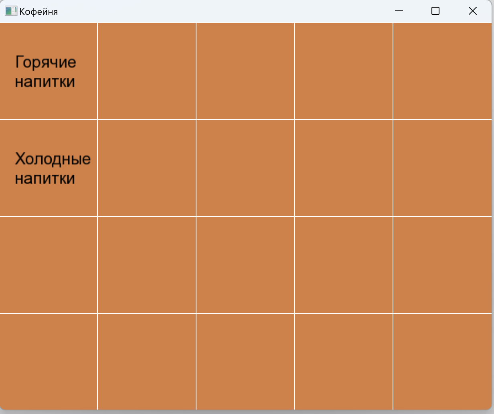
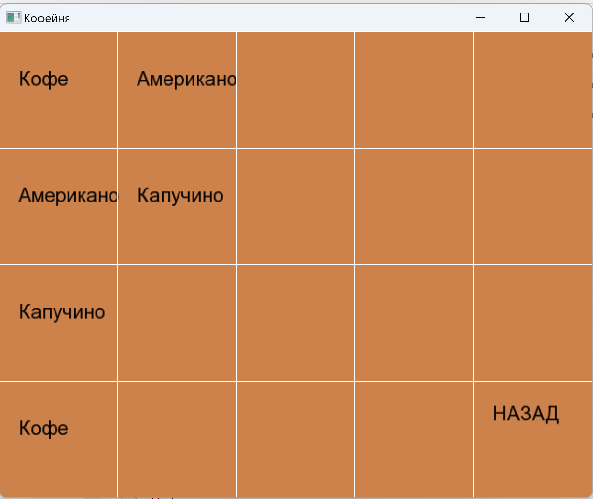
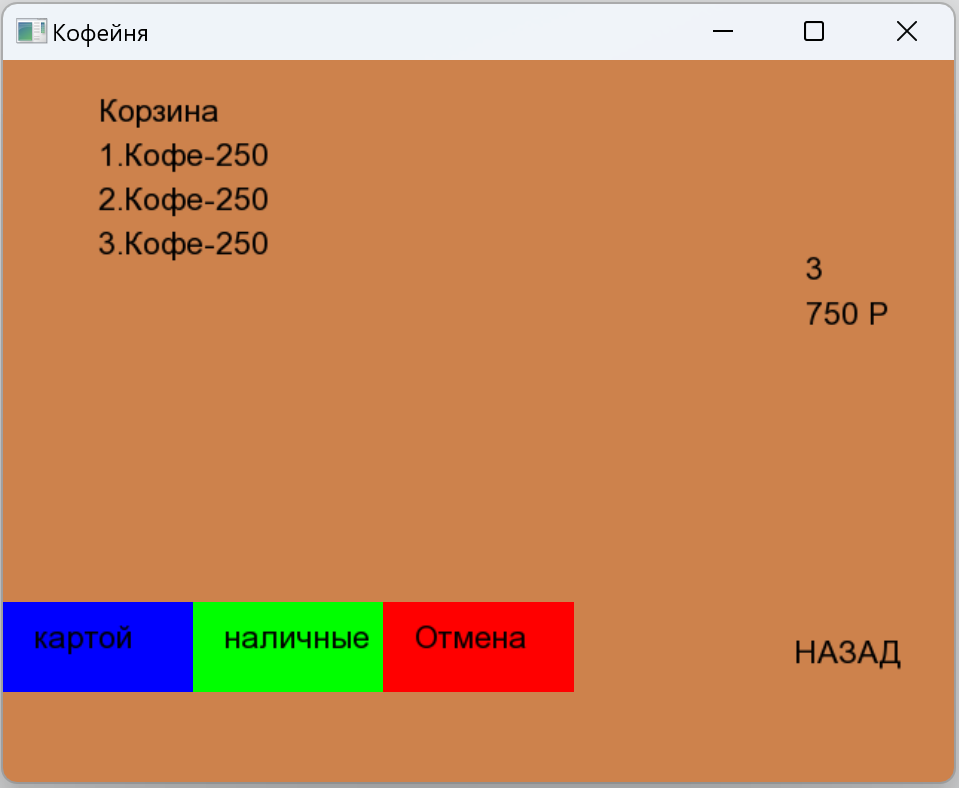

# GoodRaf

Пример приложения для ведения учёта заказов в кофейне. Приложениен написано на С++ с использованием графической библиотеки SFML. 

Реализованный функкционал:

 1. Главное окно во весь экран со списком категорий.
 1. После выбор категории попадаем в выбор продукта.
 1. После выбора продуктов в правой части появляется корзина.
 1. При нажатии на корзину открывает список добавленных товаров
 1. В корзине можно удалять товары, выбрать способ оплаты, заказ сразу завершается
 1. Все созданные заказы сохраняются в отдельный файлы.
 1. Список категори, товаров и цены расположены во внешнем файле

 ## Пример экранов приложения

 ### Стартовый экран с выбором категории

 

 ### Экран выбор продукта

 

 ### Корзина с товарами

 